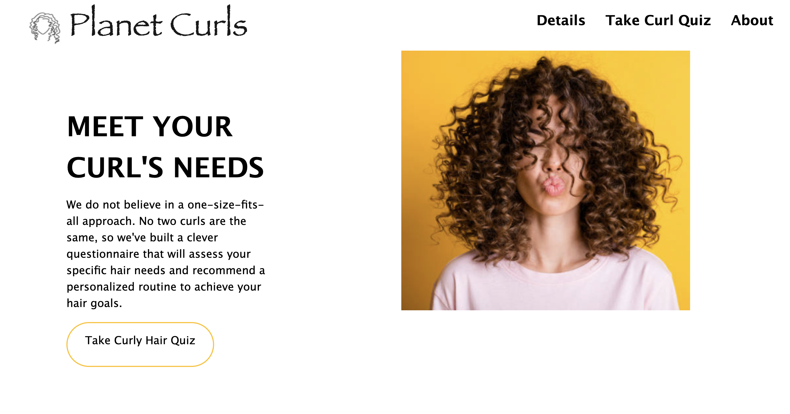
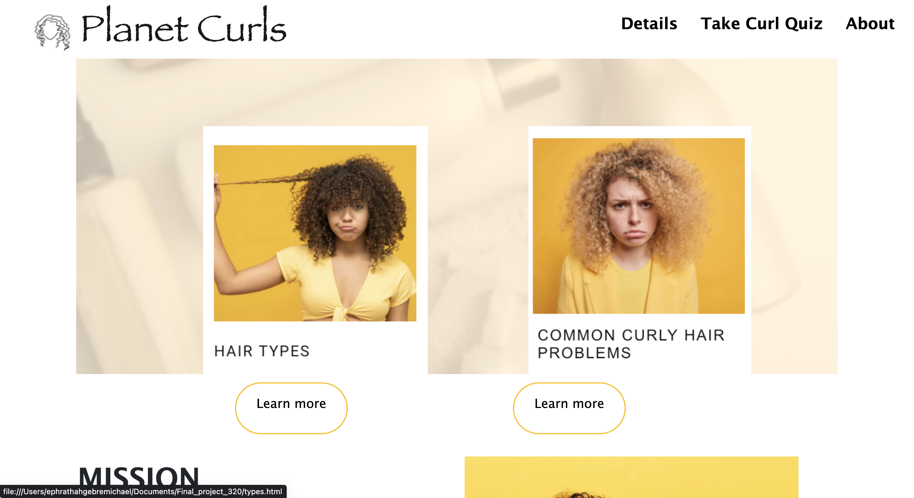

# Planet Curls

### Project description

This project was built to help curly haired people shop for hair products. The market is highly dominated by straight hair products and 
for the longest time it was deemed unprofessional to wear your natural hair if you have textured hair. 
ur motivation for this project was to provide a resource for curly hair people to find the right products for their hair type. We included 3 shampoo, 3 conditioner, and a styler recommendation.

This project was built by:
* Rekik Ziku - Class of 2023 and
* Ephrathah Gebremichael - Class of 2024

To run the application simply run index.html 

To learn more about curly hair click on learn more.

Buttons: 
* Take Curly Hair Quiz - to start taking the quiz
* About - developers info
* Home - home page 

## This project was highly inspired by the curlsmith website
## Quiz questions were made to mimic the curlsmith curl quiz

